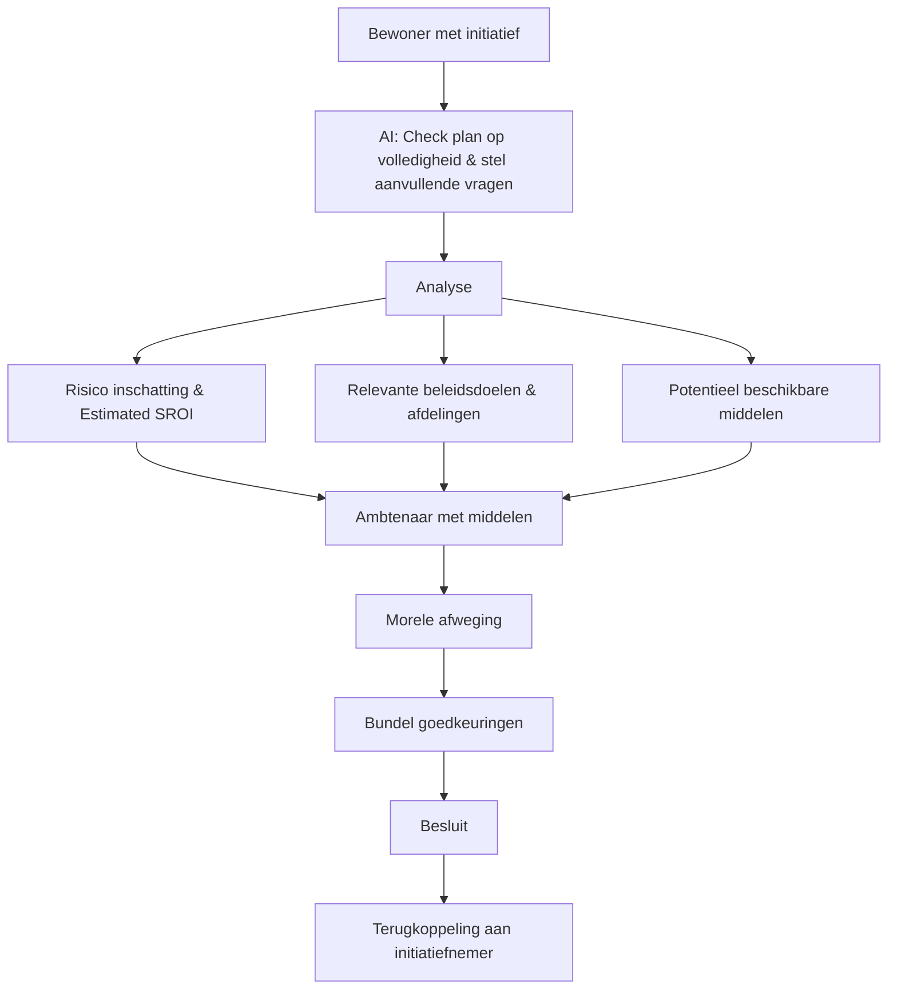

“We are at a crisis of trust,” hoorde ik Jacqueline van den Ende zeggen bij The School for Moral Ambition. En terwijl het vertrouwen wegzakt, zien ambtenaren zichzelf steeds vaker als uitvoerders die vooral naar boven moeten kijken. Het politieke primaat, de verantwoordingsdruk, de juridische dreiging: alles trekt hun aandacht weg van wat ze in wezen zijn.

Want je hoeft niet heel ver te kijken om te zien dat ambtenaren geen neutrale positie kunnen innemen. Ambtenaren werken dagelijks op het spanningsveld van twee werelden: het algemeen belang van beleid en bestuur, en het lokale belang van bewoners. Precies op dat snijvlak, tussen het persoonlijke en het gemeenschappelijke belang, liggen twee belangrijke vragen die we misschien te weinig stellen:

Wie neemt het initiatief, en wie wordt er geraakt?

Initiatief nemen gaat over wie durft te beginnen. Impactdenken gaat over wie door die keuze geraakt wordt. De ambtenaar is de degene die beide tegelijk moet overzien.

Ondertussen is de samenleving vastgelopen tussen twee logica’s. De verzorgingsstaat, die zegt: “Wij doen het wel voor je.” De markt, die zegt: “Doe alleen als het financieel rendabel is.” Wie iets wil bijdragen aan het gemeenschappelijke vindt geen van beide deuren open.

We trainen burgers om te passen in systemen die we zelf nauwelijks begrijpen, in plaats van hen te vormen tot kritische denkers die maatschappelijk initiatief durven nemen. We leren elkaar hoe te functioneren binnen bestaande structuren: niet hoe we volwaardig kunnen deelnemen aan het vormgeven ervan. Voor maatschappelijke initiatiefnemers bestaat nauwelijks een plek: Ze vallen tussen alle systemen door.  Daar is geen duidelijke ingang, geen steun, geen erkenning: Met een beetje geluk hoogstens een verdwaald financieringspotje.

Al de potjes die de overheid kent voor het aanpakken van maatschappelijke uitdagingen, komen top-down tot stand. Elk vanuit een eigen logica, een eigen taal, een eigen verantwoording. Daardoor ontstaat een versnipperde werkelijkheid waarin bewoners voortdurend worden uitgenodigd om mee te denken binnen kaders die zij niet zelf hebben bepaald.

Die top-down logica zien we ook terug in hoe we tegenmacht hebben ingericht.

De maatschappelijke tegenmacht kent namelijk een reactieve en een proactieve pijler. Deze reactieve pijler kennen we: inspraak, participatie, consultatie. En die is, mits goed vormgegeven, heel waardevol: Met name voor thema’s die te groot of te technisch zijn om centraal óf individueel op te lossen. Reactieve democratie is geen afschuiven van verantwoordelijkheid, maar het scheppen van collectieve denkruimte.

De uitdaging is dat we die andere pijler onderschatten: de proactieve tegenmacht: alles wat mensen zélf doen om hun leefwereld te verbeteren. Buurtinitiatieven, zorgcollectieven, energiecoöperaties, sportverenigingen. We behandelen ze als lief werk, als luxe, als iets voor gemotiveerde en financieel stabiele mensen. Terwijl dit precies de plekken zijn waar maatschappelijke veerkracht ontstaat: in gedrag, relaties, keuzes, gemeenschap. 𝗛𝗲𝘁 𝘇𝗶𝗷𝗻 𝗴𝗲𝗲𝗻 𝗮𝗹𝘁𝗲𝗿𝗻𝗮𝘁𝗶𝗲𝘃𝗲𝗻 𝘃𝗼𝗼𝗿 𝗱𝗲 𝗱𝗲𝗺𝗼𝗰𝗿𝗮𝘁𝗶𝗲. 𝗭𝗲 𝘇𝗶𝗷𝗻 𝗱𝗲 𝗱𝗲𝗺𝗼𝗰𝗿𝗮𝘁𝗶𝗲.

Voor sommige mensen werkt dat: zij weten de weg, spreken de taal, hebben tijd en ruimte. Voor veel anderen geldt precies het tegenovergestelde. Zij pissen standaard naast de pot. Niet omdat ze minder betrokken zijn, maar omdat de overheid eenvoudigweg onvindbaar is.

We hebben een systeem gebouwd waarin de toegang tot initiatief niet gelijk is; waarin alleen mensen met het juiste instantiekapitaal weten waar ze moeten aankloppen; en waarin beleidsdomeinen zo verkokerd zijn geraakt dat maatschappelijke waarde nauwelijks meer als geheel wordt gezien. Het systeem vraagt inspraak, maar biedt eigenlijk geen ingang. Het nodigt uit tot reactie, maar niet vaak écht tot initiatief.

Ondertussen proberen we alle problemen vooral door slimmere mensen op grootse schaal op te lossen. Slimme figuren rekenen aan systemen die in één keer grootse, meeslepende impact gaan maken. We compenseren centraal voor het probleem van centralisatie.

Het is tijd voor een nieuwe vraag:

Wat als we de democratie opnieuw benaderen, niet vanuit inspraak, maar vanuit initiatief én impact? Vanuit rechtvaardigheid, en vanuit menselijkheid?

---

## De democratie begint bij initiatief; precies dáár gaat het al mis

We hebben een democratie gebouwd waarin meedoen vooral begint wanneer het systeem een vraag formuleert. Een inspraakavond, een vragenlijst, een consultatie. Ik durf het bijna niet te zeggen, maar dit gaat zelfs ook over verkiezingen. Waardevol, maar pas nádat de koers al is bepaald.

De impuls van bewoners komt zelden centraal te staan. Niet omdat mensen onverschillig zijn, maar omdat de drempels hoog zijn. Tijd, taal, netwerk, geld, digitale geletterdheid: allemaal bepalen ze wie kan, en wie niet.

De kans om initiatief te nemen is daarmee niet democratisch verdeeld. En pijnlijk genoeg: juist zij die het hardst geraakt worden door beleid, zijn niet degenen die de overheid als eerste weten te vinden.

In sport weten we: groei ontstaat door veilige oefenruimte, niet door perfecte instructie.
In de democratie geldt hetzelfde. Maatschappelijke waarde is stuntelen, en het systeem herkent maatschappelijke waarde en risico nemen helaas maar moeilijk.

Wanneer iemand wél de moed vindt om iets te starten, gebeurt er iets interessants: hun initiatief raakt vrijwel altijd meerdere beleidsdoelen tegelijk. Een lokale voedselcoöperatie raakt gezondheid, armoede, leefbaarheid, mentale veerkracht, klimaat en sociale cohesie. Een energie-initiatief raakt betaalbaarheid én duurzaamheid. Een buurtcollectief vermindert zorgdruk én versterkt participatie.

Maar de overheid ziet dat niet. Niet omdat ze niet wil, maar omdat ze het niet meer kán. Elk domein werkt met eigen KPI’s, eigen potjes, eigen verantwoordingssystemen. Daardoor blijft precies de waarde die domeinoverstijgend is; de waarde van samenleven, maatschappelijke veerkracht, en menselijkheid buiten de deur. En ook hiervoor hebben we niet te weinig beleidsinstrumenten of financieringsmiddelen. Ze zijn er allang. We hebben alleen te weinig infrastructuur om te koppelen, om de verbinding tussen maatschappelijke waarde en al die individuele kokers te herkennen.

---

## Wat als impact de schaal van besluitvorming bepaalt?

Wie beslist, hangt af van wie geraakt wordt. Dat klinkt vanzelfsprekend, maar het is radicaal wanneer je het echt meent. Impact dwingt drie vragen af:

- Wie voelt dit direct?
- Heeft diegene realistische alternatieven?
- Kan een lokaal besluit grotere collectieve schade veroorzaken of juist oplossen?

Deze vragen bepalen niet alleen waar een besluit thuishoort, maar ook welke vorm van betrokkenheid gerechtvaardigd is. Dat is iets anders dan inspraak als standaardprocedure. Dit is een rechtvaardigheidsvraag.

Niet elke stem moet even luid klinken, maar elke stem moet even rechtvaardig worden gewogen. Schaaleerlijkheid is geen organisatorische keuze. Het ís de democratische keuze. De ambtenaar moet wegen:

- Individueel belang versus collectief belang
- Kans tot initiatief versus risico voor kwetsbaren
- Lokale creativiteit versus nationale veiligheid
- Uitzonderingen versus gemiddelden

De ambtenaar vertegenwoordigt de mensen (en natuur, ruimte, dieren, toekomst) die wél geraakt worden, maar níet aan tafel zitten. Ze zijn geen uitvoerders; ze zijn de enige functionarissen die zowel de impuls van beneden als de impact naar boven tegelijk zien.

Precisie in afweging begint waar initiatief en impact elkaar raken.

---

## Een Voordeur van de Overheid: AI als netwerkdenker

Het samenlevingssysteem heeft een schaal en complexiteit bereikt die menselijk netwerkdenken overstijgt. Dat is geen tekortkoming: het is het gevolg van maatschappelijke rijkdom en urgentie. Die complexiteit biedt ook juist kansen: Systeemdenken dat we niet meer kunnen, maar ook niet hoéven doen. Het morele werk doen we zelf, maar we kunnen AI als infrastructuur inzetten om die verbindingen te leggen.

Net zoals ‘Signalen’ binnen gemeenten nu meldingen bij de juiste afdeling legt, kunnen we een “voordeur” ontwikkelen die werkt voor initiatieven. Gewoon een plek waar je als bewoner kan delen. Democratisch radicaal in eenvoud.

Eén plek waar elk initiatief kan landen, waarna het systeem:

- Koppelt aan alle beleidsdoelen die geraakt worden
- Relevante gemeentelijke, regionale en nationale afdelingen samenbrengt
- Potjes bundelt die nu achter vijftien formulieren verborgen zitten
- Zowel domeinoverstijgende als domeinspecifieke SROI berekent
- Zichtbaar maakt waar kansen liggen en wat samenwerking vraagt
- Initiatiefnemers (real-time) terugkoppeling geeft over haalbaarheid, voorwaarden en passende schaal

---

## Concept workflow

## Een nieuwe maatschappelijke democratie

Wanneer initiatief, waarde, schaal en menselijke afweging weer in één systeem terechtkomen, verandert de democratie niet door reorganisatie, maar door infrastructuur.

Dan ontstaat een samenleving waarin:

- Bewoners niet verdwalen in potjes

- Ambtenaren kunnen samenwerken zonder nieuwe organogrammen

- Investeringen kansrijker worden omdat ze verbonden zijn aan menselijk initiatief

- Meer mensen verantwoordelijkheid durven nemen

- Vertrouwen groeit omdat deuren opengaan in plaats van dichtvallen

Misschien is dat wat oa. Herman Tjeenk Willink bedoelt wanneer hij zegt dat maatschappelijke democratie de institutionele democratie moet verrijken: niet door méér instrumenten, maar door beter georganiseerde ruimte voor menselijkheid.

Rob Jetten zei onlangs: “We willen laten zien dat doorbraken wel degelijk mogelijk zijn, als we samenwerken en durven moeilijke keuzes te maken.” Misschien is dit zo’n keuze.

Democratie begint niet alleen bij de overheid. Hij begint ook bij mensen die durven, en kúnnen, beginnen. We hoeven slechts iets kleins te herstellen: een open deur. Die drempel kunnen we echt verlagen, de vraag is alleen: Wie neemt het initiatief om dit mogelijk te maken?